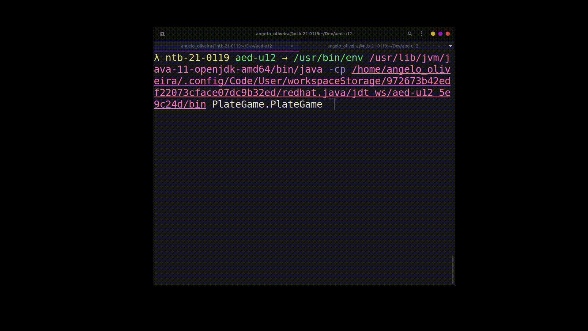

## Avaliação Geral - Algoritmos e Estruturas de Dados - U12 - Parte 2
### Angelo Fernandes 

### Cenário 1

Você vai implementar um jogo que se baseia em lavar pratos em um restaurante. Os jogadores são lavadores de pratos, que
ficam na cozinha lavando os pratos empilhados vindos das mesas dos clientes e trazidos pelos garçons. A quantidade de lavadores é
estabelecida no início do jogo e, assim, se forma uma equipe ou um trabalho individual (lavador solitário). O objetivo do jogo é que os
lavadores consigam zerar a pilha no menor tempo possível. Se os garçons empilharem um número de pratos superior a N (número
estabelecido no início do jogo – tamanho máximo da pilha), então o jogo é encerrado e a equipe de lavadores perde. Cada garçom, quando
entra na cozinha, empilha uma quantidade X de pratos que ele traz do salão de clientes (você pode usar o Random para definir esse valor de
X a cada rodada). Quando um lavador joga, ele vai conseguir lavar Y pratos (você pode usar Random para definir este valor de Y). A cada
instante deve ser possível observar quantos pratos há na pilha.

Este cenário utiliza das classes
`Stack`, `Washer` e tem como executável a classe `PlateGame`

#### Exemplo de execução cenário 1

  

### Cenário 2

Implemente um software de controle de atendimentos em uma clínica com vários médicos, várias recepcionistas e que atende a
centenas de pacientes por dia. Quando um paciente chega na clínica, ele puxa um ticket em uma maquineta logo na entrada da clínica. Para
puxar este ticket, ele pode escolher entre três alternativas: atendimento normal, prioridade (idosos, deficientes etc.) e urgência. Quando
um(a) recepcionista chama o próximo paciente a ser atendido, ela aciona uma tecla no sistema que, por sua vez, mostra em um painel qual
ticket vai ser atendido e qual guichê vai atendê-lo. Urgências sempre “passam na frente”, depois vêm os pacientes do tipo “prioridade” e ,
finalmente, são chamados os pacientes relacionados a atendimentos “normais”. O paciente fornece, no guichê, seu nome e dados pessoais
(nome, cpf, endereço, telefone e se ele possui algum plano de saúde). Quando passam pelo guichê, o paciente vai ser direcionado a outra fila
– a do médico que irá atendê-lo. Dessa forma, o processo de enfileiramento se repete, só que para cada médico. Quando o paciente vai ser
atendido pelo médico, ele é chamado pelo nome (o ticket só serve para a primeira etapa do processo – para ir ao guichê). Quer o paciente
esteja no primeiro passo do processo (filas para guichês) ou no segundo (filas dos médicos) ele pode saber quantas pessoas existem na frente
dele.

`Queue`, `Patient`, `Ticket` e tem como executável a classe`AttendenceControl`

#### Exemplo de execução cenário 2

  

